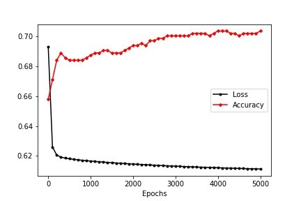

# Diabetes logistic Regression
Making a model, to predict if someone has diabetes or not. Took the dataset from [Kaggle](https://www.kaggle.com/datasets/mathchi/diabetes-data-set)
## Loss and Accuracy Plot

- Max accuracy on training: 70.3%
- Accuracy on testing: 67.53%
